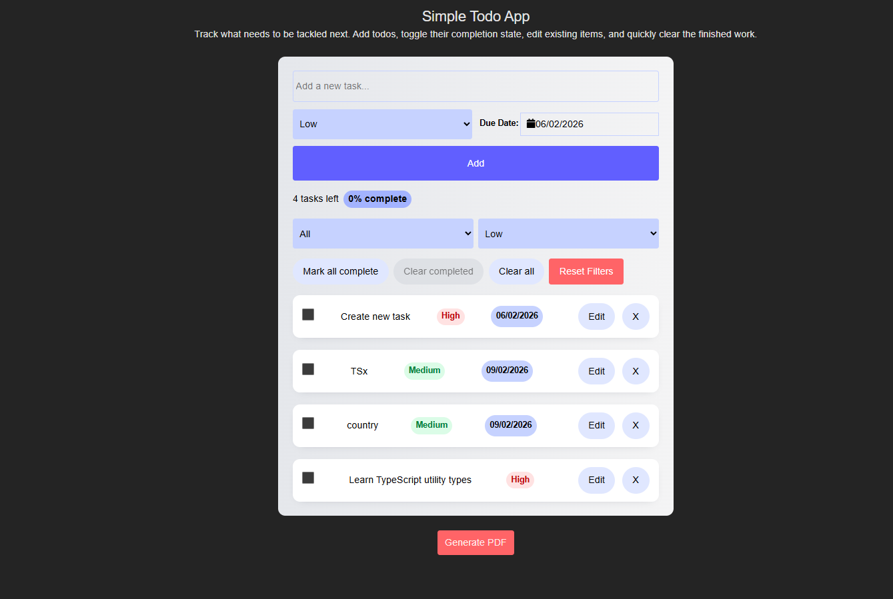

# React Todo App

A simple and interactive Todo application built with **React**. This project allows users to add, delete, and mark tasks as completed. It also persists data in **localStorage** so your tasks stay even after a page reload.

---

## Table of Contents

- [Demo](#demo)
- [Features](#features)
- [Tech Stack](#tech-stack)
- [Getting Started](#getting-started)
- [Usage](#usage)
- [License](#license)

---

## Demo




---

## Features

- Add new tasks
- Delete existing tasks
- Mark tasks as completed
- Persist tasks in `localStorage`
- Responsive UI
- Filter dropdown
- Generate pdf formate

---

## Tech Stack

- **React** - Frontend library
- **TypeScript** (optional) - Type safety
- **CSS / Tailwind / Styled Components** - Styling
- **localStorage** - For data persistence

---

## Getting Started

### Prerequisites

Make sure you have **Node.js** and **npm** installed:

```bash
node -v
npm -v
```
---

## Installation
```bash
git clone https://github.com/shahadat-hive008/React-project.git

cd React-project

npm install

npm start
```
---
## License

© 2026 Shahadat. This project is licensed under the MIT License.


